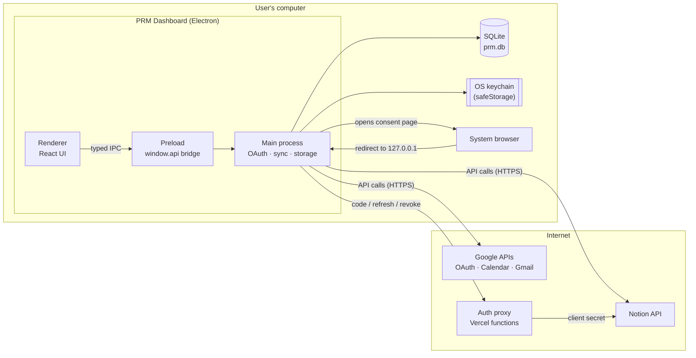

# Architecture

PRM Dashboard is a **local-first desktop app**. It pulls data from Google Calendar, Gmail and Notion, caches it encrypted on the user's computer, and shows it in a customizable widget grid. The only server is a tiny stateless auth proxy that exists because Notion's OAuth requires a client secret.

## System overview



## Components

### Desktop app (`apps/desktop`)

Electron has three process types. Each one has a single job and a strict boundary.

| Process      | Location        | Responsibility                                                                                                          | Can access                             |
| ------------ | --------------- | ----------------------------------------------------------------------------------------------------------------------- | -------------------------------------- |
| **Main**     | `src/main/`     | Runs OAuth flows, calls provider APIs, runs the sync scheduler, owns SQLite and the keychain, validates every IPC call. | Node.js, network, filesystem, keychain |
| **Preload**  | `src/preload/`  | Exposes the typed `DesktopApi` as `window.api` through `contextBridge`. Contains no logic.                              | `ipcRenderer` only                     |
| **Renderer** | `src/renderer/` | React UI: dashboard grid, widgets, Connections page. Reads data only through `window.api`.                              | Nothing but `window.api` (sandboxed)   |

The renderer never sees tokens and never calls external APIs. Every piece of provider data it displays comes from the local cache.

### Auth proxy (`apps/auth-proxy`)

Three Vercel serverless functions. They hold `NOTION_CLIENT_SECRET` and store nothing.

| Endpoint                   | Purpose                                                                                       |
| -------------------------- | --------------------------------------------------------------------------------------------- |
| `GET /api/notion/callback` | Notion's fixed redirect URI. Bounces the browser to the app's loopback port found in `state`. |
| `POST /api/notion/token`   | Exchanges an authorization code or refresh token for tokens, using the client secret.         |
| `POST /api/notion/revoke`  | Revokes a token when the user disconnects.                                                    |

Google needs no proxy: desktop OAuth clients use PKCE, and Google treats their client secret as non-confidential.

### Shared types (`packages/shared`)

A single `index.ts` defining the IPC contract (`DesktopApi`) and the normalized data types (`NormalizedEvent`, `NormalizedEmail`, `NotionItem`, `Widget`, …). Main, preload and renderer all import it, so a contract change fails typechecking everywhere it matters.

## Main process modules

```
src/main/
├─ index.ts            App lifecycle: single-instance lock, window, keychain unlock, wiring
├─ app-protocol.ts     Serves the built renderer from app://renderer (packaged builds)
├─ ipc.ts              Registers one ipcMain.handle per DesktopApi method, validates arguments
├─ sync.ts             SyncService: schedules and runs syncs, tracks account status
├─ store.ts            Store: accounts, encrypted item cache, widget layout (Drizzle over SQLite)
├─ data-cipher.ts      AES-256-GCM for cached items
├─ secrets.ts          safeStorage (OS keychain) wrapper for tokens and the data key
├─ db/                 openDb, schema.ts (Drizzle), migrations.ts (inline SQL, PRAGMA user_version)
├─ oauth/              Pure OAuth helpers: loopback listener, PKCE, Google and Notion token calls
├─ providers/
│  ├─ types.ts         ProviderAdapter interface: connect / sync / revoke
│  ├─ google-adapter.ts, notion-adapter.ts   Adapters used by sync and IPC
│  └─ gcal.ts, gmail.ts, notion.ts           API fetchers + mappers to normalized types
├─ http.ts             fetchJson (401 → AuthRevokedError), bounded-concurrency map
├─ errors.ts           AuthRevokedError, ConnectCancelledError, HttpError, errorMessage
└─ env.ts              MAIN_VITE_* configuration from apps/desktop/.env
```

Modules that don't import `electron` (everything in `oauth/`, the fetchers and mappers, `store.ts`, `sync.ts`, `data-cipher.ts`) are unit-tested directly with Vitest. Network calls take an injectable `fetchFn`.

## Provider adapters

Each integration implements one interface (`src/main/providers/types.ts`):

```ts
interface ProviderAdapter<Tokens> {
  id: ProviderId
  connect(ctx: ConnectContext): Promise<ConnectResult> // run OAuth, return tokens + account identity
  sync(ctx: SyncContext<Tokens>): Promise<void> // fetch fresh data, write it to the store
  revoke(tokens: Tokens): Promise<void> // revoke access at the provider
}
```

Adapters throw `AuthRevokedError` when credentials are no longer valid. The sync service turns that into a "needs reconnect" account status. Adding Microsoft (Outlook mail and calendar) means adding one adapter plus its fetchers. See the [development guide](development.md#add-a-provider).

## IPC contract

The renderer calls these methods on `window.api`. Each maps 1:1 to an `ipcMain.handle` channel with the same name.

| Method                                         | Returns                            | Notes                                                           |
| ---------------------------------------------- | ---------------------------------- | --------------------------------------------------------------- |
| `listAccounts()`                               | `AccountSummary[]`                 | Never includes tokens                                           |
| `connect(provider)` / `cancelConnect()`        | `Result<AccountSummary>`           | Opens the browser; resolves when the user finishes or cancels   |
| `disconnect(accountId)`                        | `Result<{ revoked: boolean }>`     | Best-effort revoke (10 s timeout), then local delete            |
| `listEvents({ from, to })`                     | `NormalizedEvent[]`                | Events overlapping the range                                    |
| `listEmails(filter)`                           | `NormalizedEmail[]`                | `unread` / `important` / `all`                                  |
| `listNotionItems(dataSourceId \| null)`        | `NotionItem[]`                     | `null` = recent pages                                           |
| `listNotionDataSources()`                      | `Result<NotionDataSourceOption[]>` | Live Notion search across connected workspaces                  |
| `listWidgets()` / `saveWidgets(widgets)`       | `Widget[]` / `void`                | Saving a new Notion database triggers a sync of Notion accounts |
| `syncNow()` / `getSyncState()`                 | `void` / `SyncState`               |                                                                 |
| `openExternal(url)`                            | `void`                             | `https://` only                                                 |
| `onDataUpdated(cb)` / `onSyncStateChanged(cb)` | unsubscribe function               | Main → renderer push events                                     |

Errors that the UI should display cross IPC as `Result` values rather than rejected promises, so the message survives intact.

## Renderer

- **Data fetching:** TanStack Query hooks in `lib/api.ts` wrap `window.api`. Queries never go stale on their own (`staleTime: Infinity`). Instead the main process pushes `data-updated` after each sync, and every query under the `['data']` key is invalidated.
- **Dashboard:** `pages/Dashboard.tsx` uses react-grid-layout (12 columns, 40 px rows). Drag, resize, add and remove all persist through `saveWidgets`.
- **Widgets:** registered in `widgets/registry.tsx` with a title, icon, component and default config and size. Each widget wraps its content in `WidgetFrame` and `RequireAccount`, which handles the "connect" and "reconnect" states.
- **Styling:** Tailwind v4 with theme tokens in `index.css`. Light and dark follow the OS setting.

## Runtime lifecycle

1. `registerAppScheme()` runs, then the single-instance lock is taken (per user-data folder).
2. When the app is ready:
   - `openDb()` runs pending migrations.
   - `openEncryptedStore()` unwraps the data key through the keychain. If that fails, it shows a dialog with Try Again or Quit.
   - `registerIpc()` runs and the window opens: the Vite dev server in development, `app://renderer/index.html` when packaged.
3. `SyncService.start()` runs an initial sync and then one every 5 minutes. Focusing the window re-syncs if the last run is over a minute old.

## Repository layout

```
prm/
├─ apps/
│  ├─ desktop/          Electron app (electron-vite + electron-builder)
│  └─ auth-proxy/       Vercel functions for Notion OAuth
├─ packages/shared/     IPC contract and data types
├─ docs/                This documentation
├─ vitest.config.ts     One test runner for every workspace
├─ eslint.config.js
└─ tsconfig.base.json
```

It's an npm workspaces monorepo. Only `better-sqlite3` is a runtime `dependency` of the desktop app. Everything else is bundled into `out/` at build time.
