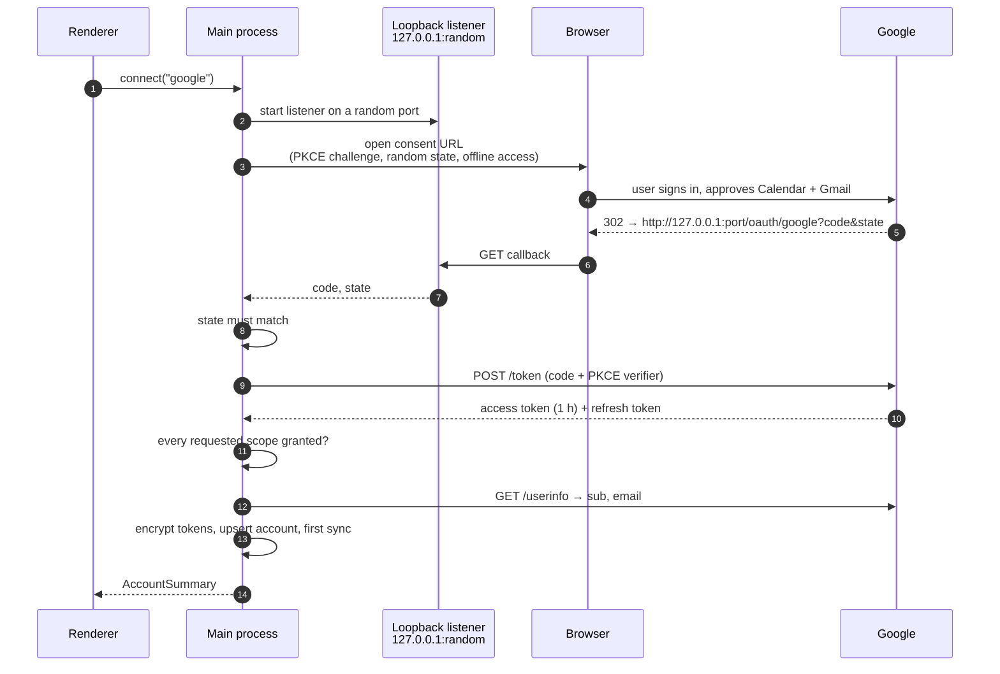
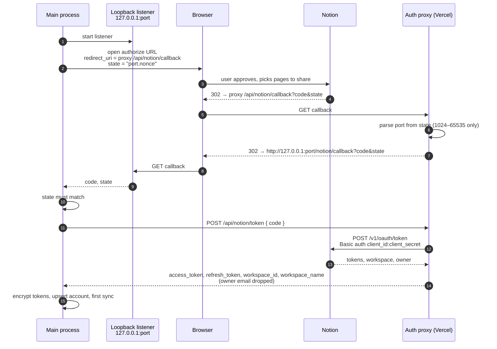

# Authentication flows

Both providers use OAuth 2.0 in the **system browser**, following RFC 8252 (OAuth for native apps). The app never shows a login form and never sees a password. It starts a one-shot HTTP listener on `127.0.0.1` with an OS-assigned port. The browser is redirected back to that listener, which hands the authorization code to the main process.

Code: `apps/desktop/src/main/oauth/` and `apps/desktop/src/main/providers/*-adapter.ts`.

## Google (Calendar + Gmail)

Google supports native apps directly: a **Desktop app** OAuth client, PKCE, and a loopback redirect. Google documents that a desktop client's secret isn't confidential, so it's fine to ship inside the app.

**Scopes:** `openid`, `email`, `calendar.readonly` and `gmail.readonly`. If the user unchecks Calendar or Gmail on the consent screen, connect fails with a message asking them to allow both.

**Account identity:** the Google `sub`. Reconnecting the same Google account updates it in place.

## Notion

Notion requires a **client secret** to exchange codes and only accepts fixed HTTPS redirect URIs. Neither works for an app installed on thousands of machines. The auth proxy solves both without storing anything.

**Why this is safe:**

- **No open redirect.** The proxy only ever redirects to `127.0.0.1`, and the port must match a strict pattern.
- **Stateless proxy.** Even if the proxy were compromised, it holds no user data.
- **Codes can't be injected.** The random `state` nonce is checked by the app, not the proxy, so a code from someone else's sign-in is rejected.

**Account identity:** the Notion `workspace_id`. The app only sees pages and databases the user shares during consent, or adds later from Notion's page **Connections** menu.

## Token lifecycle

| Event                      | Google                                                                   | Notion                                                                                    |
| -------------------------- | ------------------------------------------------------------------------ | ----------------------------------------------------------------------------------------- |
| Storage                    | JSON encrypted with `safeStorage` in `accounts.tokens`                   | Same                                                                                      |
| Before each sync           | Refresh if the access token expires within 60 s; persist new tokens      | Use stored access token                                                                   |
| API returns 401            | `AuthRevokedError` → account `needs_reauth`                              | Refresh once through the proxy if a refresh token exists, retry; otherwise `needs_reauth` |
| Refresh rejected           | `invalid_grant` → `needs_reauth`                                         | Proxy 400/401 → `needs_reauth`                                                            |
| User clicks **Reconnect**  | New OAuth flow; same `sub` updates the account and clears the status     | Same, keyed by `workspace_id`                                                             |
| User clicks **Disconnect** | `POST oauth2.googleapis.com/revoke` (refresh token), then delete locally | `POST proxy /api/notion/revoke`, then delete locally                                      |

Accounts marked `needs_reauth` are skipped by sync until reconnected. Their cached data stays visible with a banner.

> **Google "Testing" mode:** refresh tokens expire after **7 days** while the OAuth consent screen is in Testing. That shows up as a weekly "Reconnect" prompt, which is expected. It stops once the app is published and verified.

## Cancelling and timeouts

- **Cancel:** the Connections page shows **Cancel** while waiting. It aborts the pending flow and closes the listener.
- **Timeout:** a flow that never returns times out after **5 minutes**.
- **Restart:** starting a new connect aborts any flow still in progress.
- **Disconnect revocation** times out after 10 seconds. If it fails (for example offline), local data is still deleted, and the UI links to the provider's settings page so the user can remove access by hand.

## Configuration

| Variable                         | Where                   | Notes                                            |
| -------------------------------- | ----------------------- | ------------------------------------------------ |
| `MAIN_VITE_GOOGLE_CLIENT_ID`     | `apps/desktop/.env`     | Desktop app client                               |
| `MAIN_VITE_GOOGLE_CLIENT_SECRET` | `apps/desktop/.env`     | Non-confidential for desktop clients             |
| `MAIN_VITE_NOTION_CLIENT_ID`     | `apps/desktop/.env`     | Public                                           |
| `MAIN_VITE_AUTH_PROXY_URL`       | `apps/desktop/.env`     | e.g. `https://prm-auth-proxy.vercel.app`         |
| `NOTION_CLIENT_ID`               | Vercel env (Production) | Must match the desktop value                     |
| `NOTION_CLIENT_SECRET`           | Vercel env (Production) | Never in the desktop app or the repo             |
| `NOTION_REDIRECT_URI`            | Vercel env (optional)   | Pin it if the proxy is reachable at several URLs |

`MAIN_VITE_*` values are compiled in when the app starts or builds, so restart `npm run dev` after editing `.env`. Vercel only applies environment variables to new deployments, so redeploy after changing them.
