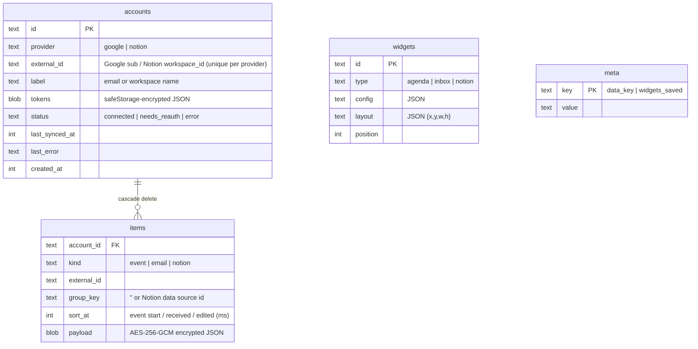
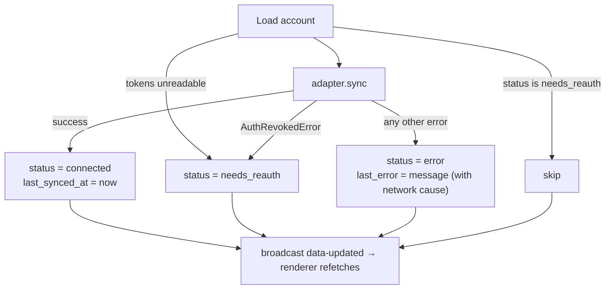

# Data and sync

Provider data is fetched by the main process, normalized, encrypted and written to a local SQLite database. Widgets only ever read that cache, which is why the dashboard loads instantly and works offline.

## Where data lives

| Data                         | Location                                                     | Protection                                 |
| ---------------------------- | ------------------------------------------------------------ | ------------------------------------------ |
| Database                     | `~/Library/Application Support/PRM Dashboard/prm.db` (macOS) | See below                                  |
| OAuth tokens                 | `accounts.tokens`                                            | Encrypted with `safeStorage` (OS keychain) |
| Cached emails, events, pages | `items.payload`                                              | AES-256-GCM with the data key              |
| Data key                     | `meta` row `data_key`                                        | Wrapped with `safeStorage`                 |
| Widget layout and settings   | `widgets`                                                    | Plaintext (no personal content)            |

On Windows the database lives under `%APPDATA%\PRM Dashboard`, and on Linux under `~/.config/PRM Dashboard`. Launching with `--user-data-dir=<folder>` uses a separate profile.

## Schema



- **`items` primary key:** `(account_id, kind, group_key, external_id)`, with an index on `(kind, sort_at)`.
- **Definitions:** Drizzle schema in `src/main/db/schema.ts`, SQL in `src/main/db/migrations.ts`.
- **Connection pragmas:** `journal_mode = WAL`, `foreign_keys = ON`, `secure_delete = ON`.

## Encryption at rest

```
payload blob = IV (12 bytes) | GCM auth tag (16 bytes) | ciphertext
```

- **The data key:** a random 32-byte key, created on first launch. It's stored wrapped by the OS keychain (`meta.data_key`) and unwrapped once at startup.
- **Encrypting and decrypting:** each item is JSON-serialized and encrypted with a fresh IV. Rows that fail authentication (corrupted or tampered) are skipped when read, and the next sync rewrites them.
- **If the keychain key is lost:** for example after a keychain reset, the data key can't be unwrapped. The cache is discarded and a new key is created. Tokens can't be decrypted either, so sync marks those accounts **needs reconnect**.
- **Keychain access denied:** if the user denies access at startup, a dialog explains why it's needed and offers Try Again or Quit.

**Not encrypted:** account labels (email address or workspace name), item IDs (for calendar events these include the calendar ID), timestamps, and widget layout.

## Sync engine

`SyncService` in `src/main/sync.ts`.

### Triggers

| Trigger                                        | What runs            |
| ---------------------------------------------- | -------------------- |
| App start                                      | All accounts         |
| Every 5 minutes                                | All accounts         |
| Window focus, if the last run is over 60 s old | All accounts         |
| ↻ button (`syncNow`)                           | All accounts         |
| Account connected or reconnected               | That account         |
| A widget starts showing a new Notion database  | Every Notion account |

Concurrent `syncAll()` calls share one in-flight run. `syncAccount()` waits for any running full sync, so two syncs never write the same partitions at once.

### Per-account run



### What each adapter fetches

**Google** (`google-adapter.ts`). Calendar and Gmail run in parallel with `Promise.allSettled`, so one failing doesn't blank the other widget:

- **Calendar** (`gcal.ts`):
  - Every calendar that is checked and not hidden in Google Calendar, 4 at a time.
  - From local midnight today through 14 days out; recurring events expanded; up to 250 per calendar.
  - Cancelled events and events you declined are dropped.
  - All-day events are pinned to local midnight.
- **Gmail** (`gmail.ts`):
  - The latest 50 inbox messages, metadata only (From, Subject, Date, labels, snippet), 10 requests at a time.
  - Unread and important filtering happens locally, so one sync serves every Inbox widget.

**Notion** (`notion-adapter.ts`):

- **Recent pages:** the 20 most recently edited shared pages, stored in the `''` partition.
- **Databases:** for each data source that some widget displays and that this workspace can see, the 50 most recently edited items, each in its own partition.
- **Cleanup:** partitions for databases no widget uses anymore are pruned.
- **Mapping:** each page takes its title property, its first `status` (or `select`) property, and its first `date` property.

### Cache partitions

Each sync result replaces one partition, `(account, kind, group_key)`, inside a transaction: delete the old rows, then insert the new ones in chunks of 500. Readers never see a half-written partition, and items deleted at the provider disappear on the next sync.

## Migrations

Migrations are inline SQL strings applied in order, tracked by `PRAGMA user_version`. See [ADR-004](decisions.md#adr-004-inline-sql-migrations).

| Version | Change                                                                                                                 |
| ------- | ---------------------------------------------------------------------------------------------------------------------- |
| 1       | Initial schema: `accounts`, `items`, `widgets`, `meta`                                                                 |
| 2       | `items.payload` becomes an encrypted BLOB. Plaintext cache dropped, then `VACUUM` and WAL checkpoint scrub freed pages |

See [development guide → add a migration](development.md#add-a-database-migration) for the procedure.

## Resetting

Quit the app and delete `prm.db`, `prm.db-wal` and `prm.db-shm` from the data folder. Connected accounts are removed too, so reconnect afterward. Access granted to the app at Google and Notion remains until revoked in those services' settings.
