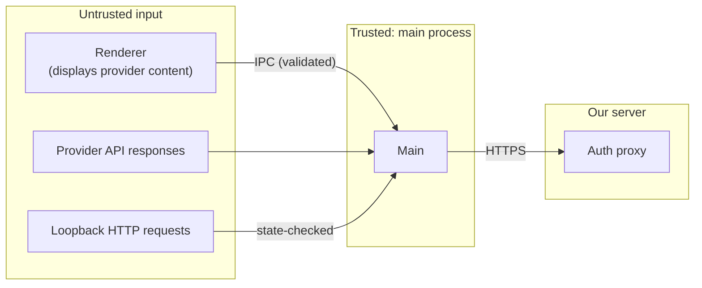

# Security

PRM Dashboard handles OAuth tokens and personal content: calendar events, email subjects and snippets, Notion pages. This page covers what's protected, from whom, and where the known limits are.

## Assets

| Asset                                       | Where it lives                                              |
| ------------------------------------------- | ----------------------------------------------------------- |
| Google refresh token (Calendar, Gmail read) | Encrypted in the local database                             |
| Notion access and refresh token             | Encrypted in the local database                             |
| Cached emails, events, Notion items         | Encrypted in the local database                             |
| Notion client secret                        | Vercel environment variable only                            |
| Google desktop client secret                | Compiled into the app (non-confidential by Google's design) |

## Trust boundaries

The renderer is treated as untrusted because it renders content from emails and Notion pages. The main process validates every IPC argument and never gives the renderer tokens.

## Threats and mitigations

| Threat                                                                                    | Mitigation                                                                                                                                       | Code                                   |
| ----------------------------------------------------------------------------------------- | ------------------------------------------------------------------------------------------------------------------------------------------------ | -------------------------------------- |
| Malicious content in an email or page runs code in the app                                | React escapes all text. No `innerHTML`. Strict CSP (`script-src 'self'`). Renderer is sandboxed with `contextIsolation` and no Node integration. | `renderer/index.html`, `main/index.ts` |
| Compromised renderer steals tokens                                                        | Tokens never cross IPC. The API only returns normalized data. `openExternal` allows only `https://`.                                             | `main/ipc.ts`, `preload/index.ts`      |
| Renderer navigates to or opens attacker content                                           | `will-navigate` blocked, `setWindowOpenHandler` denies new windows and sends `https` links to the system browser                                 | `main/index.ts`                        |
| Another app or webpage injects an OAuth code (login CSRF)                                 | Random `state` checked in the main process. PKCE for Google. Listener binds to `127.0.0.1` only, with a random port and a 5-minute lifetime.     | `main/oauth/`                          |
| Auth proxy abused as an open redirect                                                     | Redirects only to `http://127.0.0.1:<port>`, and `state` must match `^\d{4,5}\.[A-Za-z0-9_-]{16,}$`                                              | `auth-proxy/lib/notion.ts`             |
| Notion client secret leaked                                                               | Lives only in Vercel env vars. Never in the repo, the app bundle or logs.                                                                        | `auth-proxy/`                          |
| Proxy leaks user profile data                                                             | Forwards only token and workspace fields. Owner email and avatar are dropped. Errors return only the OAuth error code.                           | `auth-proxy/lib/notion.ts`             |
| Proxy spammed to exhaust the Notion client's quota                                        | Per-IP rate limit, 20 requests per 10 minutes (in-memory, best-effort)                                                                           | `auth-proxy/lib/rate-limit.ts`         |
| Another app or user on the computer reads the database file                               | Tokens and cached content encrypted (safeStorage, AES-256-GCM). `secure_delete` zeroes deleted rows. The v2 migration vacuumed old plaintext.    | `main/store.ts`, `main/data-cipher.ts` |
| Malware reuses the signed app as a Node runtime or debugger to borrow its keychain access | Electron fuses: `RunAsNode`, `NODE_OPTIONS` and `--inspect` disabled                                                                             | `electron-builder.yml`                 |
| Tampered app bundle                                                                       | Fuses: ASAR integrity validation and load-only-from-ASAR. Code signing (ad-hoc today, Developer ID before release).                              | `electron-builder.yml`                 |
| `file://` privilege abuse                                                                 | Renderer served from a privileged `app://renderer` scheme with path-traversal checks. `grantFileProtocolExtraPrivileges` fuse off.               | `main/app-protocol.ts`                 |
| Access lingers after the user disconnects                                                 | Tokens revoked at Google and Notion before local deletion, with a fallback link if revocation fails                                              | `main/ipc.ts`                          |
| Over-broad permissions                                                                    | Read-only scopes only (`calendar.readonly`, `gmail.readonly`, Notion read content)                                                               | `main/oauth/google.ts`                 |
| Vulnerable dependencies                                                                   | `npm audit` clean as of the last review. Run it before every release.                                                                            | —                                      |

## Known limitations

These are accepted for now. Each has a note on when to revisit it.

1. **Some metadata is plaintext.**
   - Unencrypted: account labels (email address or workspace name), item IDs (which include calendar IDs), timestamps.
   - Low sensitivity. Revisit if a stricter at-rest guarantee is ever needed, for example by moving to SQLCipher.
2. **Anyone running as your user can decrypt.** Anything that can run code as the logged-in user and get keychain approval can decrypt the data. That's inherent to local apps; FileVault or BitLocker protects a lost or stolen device.
3. **Rate limiting is per function instance.** Vercel may run several instances. Add a Vercel Firewall rate-limit rule on `/api/notion/*` before launch.
4. **The proxy token endpoint is public.** Someone holding a valid authorization code or refresh token for this Notion client can exchange it. Those credentials are already secrets in their own right, and codes are single-use and short-lived.
5. **Remote Notion icons load from third-party hosts.** A page icon set to an external image URL is fetched when displayed (CSP allows `img-src https:`), which reveals your IP address to that host. Consider proxying or dropping external icons.
6. **Local builds are ad-hoc signed.** They're not suitable for distribution. Sign with a Developer ID and notarize before shipping (see the [release guide](release.md)).
7. **No update integrity yet.** Auto-updates aren't implemented. When they are, use signed releases, via `electron-updater` with code-signature verification.
8. **Google desktop client secret is compiled into the app.** Google's documentation treats this as non-confidential for installed apps, and PKCE protects the flow.

## Reviewing changes

When changing anything security-relevant (IPC, OAuth, storage, the proxy, the Electron config), check:

- [ ] Does any new IPC method validate its arguments and avoid returning tokens?
- [ ] Is new personal content stored through `Store`, which encrypts it, and not in a new plaintext column?
- [ ] Does a new migration that removes plaintext data add itself to `SCRUB_AFTER`?
- [ ] Are new external URLs opened only via `openExternal` (https only)?
- [ ] Are new scopes read-only unless a feature truly needs write access?
- [ ] Does the proxy still store nothing and forward only what the app needs?
- [ ] Do `npm test`, `npm run typecheck`, `npm run lint` and `npm audit` all pass?

## Reporting a vulnerability

This is a private project for now. Report issues directly to the maintainer, Nick Pham, rather than in a public issue.
